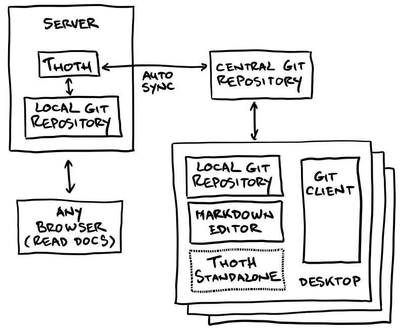

# Typical setup
A typical setup consists of a Thoth server, a Git repository, a Git client and a Markdown editor (or just a plain text editor if you prefer).
To help you understand how this is all connected consider the following diagram:

## Tools in the mix
Depending on your type of desktop there is a good choice of Markdown editors. For OSX there is a great app called [Ulysses](http://www.ulyssesapp.com) that you can use (enable ‘external folders’, enable ‘inline links’) and for Windows there are also good Markdown editors available (have a look at [MarkdownPad](http://markdownpad.com)). If you have other suggestions please let me know so I can add them to the list of suggested apps. You might also want to have a look at a WYSIWYG solution; for OSX you could consider [Marked2](http://marked2app.com). As a Git client I suggest you use the excellent [SourceTree from Atlassian](https://www.sourcetreeapp.com), unless you are a command line tiger of course because then a regular Git client would do as well (and then you would use VI as an editor right :-) ).

## Workflow
Using the above setup you will edit documents with your Markdown editor, commit changes with SourceTree, Pull any changes from the central repository and then Push all your local changes (to the central repository). Thoth will synchronize automatically with the central repository, depending on the configuration your changes will end up on the Thoth server within 60 seconds. Once available on the Thoth server anybody will be able to access them in the various formats and skins that are configured (HTML, PDF etc).