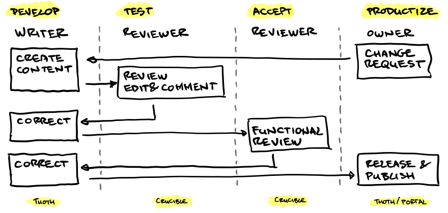

# Implementing a Review Process with Thoth
In a more formal environment working with Thoth might involve a review process that ensures nothing ends up in the final documentation that was not supposed to be there (or be there in a certain way). One way to do this is to use the Git version control system together with a tool like [https://www.atlassian.com/software/crucible](https://www.atlassian.com/software/crucible). The basic concept is that you create a new branch of the documentation that is worked on, and that this branch is only merged back when fully reviewed and approved (using a so called pull request, so the owner of the main branch stays in control).

The underlying method of implementing and accepting changes (basically the arrows in the diagram above) is described by the git flow process as described in this tutorial [https://www.atlassian.com/git/tutorials/comparing-workflows](https://www.atlassian.com/git/tutorials/comparing-workflows) or in this fairly detailed article: [http://nvie.com/posts/a-successful-git-branching-model/](http://nvie.com/posts/a-successful-git-branching-model/) (just look at the concepts; do not get intimidated by the command line code that is mentioned there because you would probably want to use a GUI client anyways)

Basically it comes down to what is depicted in the diagram above, where in a formal process the branches have access control so that only the product owner is allowed to accept the pull request and merge the feature branch back into the main branch.

# Using comments
If there is no need for a formal review process you could also use the (light weight) commenting feature. Users who are allowed to comment on a document (not necessarily writers) can then add comments to the fragments of a book directly in Thoth. 

