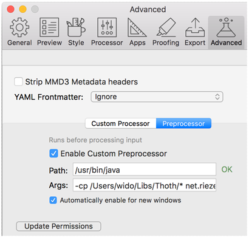

# WYSIWYG
Although writing in Markdown is all about *not* focussing on how your document is rendered it is sometimes good to have a preview. Depending on the editor you would have some WYSIWYG functionality in place, but it will most certainly not do all that Thoth can do for you. To get around this there are a couple of options.

## Use the Thoth IncludeProcessor as a pre processor
For OSX there is the excellent tool called Marked2 that supports a custom pre processor. By making use of this feature you can actually run any Thoth specific functionality (includes, link processing etc) right before it is transformed into HTML. To give you a sense of what a pre processor’s role here could be just have a look at the screenshot below. Any editor that supports a pre processor can be set up this way.

The command line that is obscured in the screenshot should be similar to

	-cp /Users/wido/Libs/thoth-lib.jar net.riezebos.thoth.markdown.IncludeProcessor 

## Use Thoth standalone with your browser
You can easily run Thoth as a standalone server on your laptop, using a File System based repository that points straight into your Git documentation repository. Read the section about configuring and installing Thoth on how to do this. Basically you just connect your browser to the locally running Thoth that will show you exactly what your rendered document looks like. Just save your document, switch to your browser and press the refresh-key. To do this; open a terminal and enter:

**`java -jar thoth-standalone-1.0.0.jar /path/to/my/config.properties`**

	Thoth is firing up. Please hang on...
	Setting up content managers...
	Thoth server started.
	You can now access Thoth at http://localhost:8080
	Just enter 'stop' to stop the server
 

## Use an editor that does WYSIWYG
If you use an editor that supports WYSIWYG and supports a pre processor as described above then you are set to go. If the editor does not support a pre processor however there will be certain features (include processing being the obvious one) that will not show up in the WYSIWYG (therefore breaking the WYG part). The WYSIWYG will then maybe helpful but it will not show you the whole story.